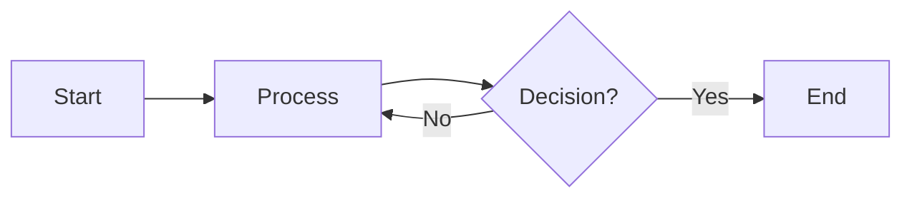
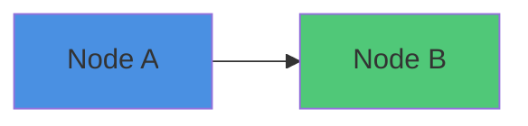

# TrustTwin Architecture Diagrams — Quick Start Guide

## 📊 How to View These Diagrams

Your architecture diagrams are written in **Mermaid** syntax — a text-based diagramming language that renders into beautiful visualizations.

---

## 🎯 Quick Viewing Options

### **Option 1: GitHub (Easiest)**

1. Push the `TrustTwin_Architecture_Diagrams.md` file to GitHub
2. Open it in your browser
3. GitHub automatically renders Mermaid diagrams!

### **Option 2: VS Code (Recommended for Editing)**

1. Install the **Mermaid Preview** extension:
   - Open VS Code
   - Go to Extensions (⌘+Shift+X on Mac)
   - Search for "Mermaid Preview" or "Markdown Preview Mermaid Support"
   - Install it
2. Open `TrustTwin_Architecture_Diagrams.md`
3. Press **⌘+Shift+V** (Mac) or **Ctrl+Shift+V** (Windows) to preview
4. Diagrams will render inline!

### **Option 3: Online Mermaid Editor (Best for Presentations)**

1. Go to: **https://mermaid.live**
2. Copy any diagram code from the file
3. Paste into the editor
4. Export as PNG, SVG, or PDF for presentations

### **Option 4: Obsidian (If You Use It)**

- Obsidian has native Mermaid support
- Just open the file and diagrams render automatically

---

## 📋 What's Included (12 Diagrams)

| #   | Diagram Name                       | Purpose                               | Best For                              |
| --- | ---------------------------------- | ------------------------------------- | ------------------------------------- |
| 1   | **High-Level System Architecture** | Complete system overview              | Executive presentations, onboarding   |
| 2   | **Data Flow Diagram**              | How decisions move through the system | Understanding processing pipeline     |
| 3   | **Component Architecture**         | Detailed service breakdown            | Engineering planning, task assignment |
| 4   | **Decision Processing Pipeline**   | Step-by-step decision flow            | Process documentation, optimization   |
| 5   | **Knowledge Graph Structure**      | How decision context is modeled       | Data modeling, graph DB design        |
| 6   | **Explanation Engine Flow**        | Multi-path explanation generation     | Feature development, UX design        |
| 7   | **Simulation Engine**              | What-if analysis architecture         | Product feature specs                 |
| 8   | **Security & Privacy Layers**      | Multi-layer security model            | Compliance, security audits           |
| 9   | **Deployment Architecture**        | Multi-region Kubernetes setup         | DevOps, infrastructure planning       |
| 10  | **Integration Patterns**           | How customers connect                 | Partner integration, API docs         |
| 11  | **Microservices Architecture**     | Service decomposition                 | Sprint planning, service design       |
| 12  | **Database Schema**                | Data model (PostgreSQL + Neo4j)       | Backend development, migrations       |

---

## 🎨 Export to Images (for PowerPoint/Keynote)

### **Method 1: Mermaid Live Editor**

1. Go to https://mermaid.live
2. Paste diagram code
3. Click **Actions** → **PNG** or **SVG**
4. Download and insert into slides

### **Method 2: VS Code Extension**

1. Install "Markdown PDF" extension
2. Right-click the file → **Markdown PDF: Export (png/svg)**
3. Individual diagrams will be saved

### **Method 3: Command Line (Advanced)**

```bash
# Install mermaid-cli
npm install -g @mermaid-js/mermaid-cli

# Convert diagrams to images
mmdc -i TrustTwin_Architecture_Diagrams.md -o diagrams/
```

---

## 🔧 Editing Diagrams

### **Mermaid Syntax is Easy!**

**Example: Simple Flowchart**



**Common Diagram Types:**

- `graph TB` — Top to Bottom flowchart
- `graph LR` — Left to Right flowchart
- `sequenceDiagram` — Sequence/timing diagrams
- `erDiagram` — Database entity relationships
- `flowchart` — Advanced flowcharts

**Styling:**



**Official Docs:** https://mermaid.js.org/

---

## 💡 Use Cases by Audience

### **For Investors:**

- Diagram #1 (High-Level Architecture) → Show technical sophistication
- Diagram #8 (Security Layers) → Prove enterprise-readiness
- Diagram #9 (Deployment) → Demonstrate scalability

### **For Engineering Team:**

- Diagram #3 (Component Architecture) → Sprint planning
- Diagram #4 (Decision Pipeline) → Implementation specs
- Diagram #11 (Microservices) → Service boundaries
- Diagram #12 (Database Schema) → Data modeling

### **For Product Team:**

- Diagram #6 (Explanation Engine) → Feature requirements
- Diagram #7 (Simulation Engine) → Product roadmap
- Diagram #10 (Integration Patterns) → Partner strategy

### **For Compliance/Security:**

- Diagram #8 (Security & Privacy) → Audit preparation
- Diagram #2 (Data Flow) → Data handling documentation

---

## 🚀 Quick Commands (Terminal)

### **View in Browser (if you have a Markdown viewer)**

```bash
# Install markdown viewer (if not installed)
brew install grip  # Mac

# View file in browser
grip TrustTwin_Architecture_Diagrams.md
# Opens at http://localhost:6419
```

### **Convert to PDF**

```bash
# Install pandoc
brew install pandoc

# Convert to PDF
pandoc TrustTwin_Architecture_Diagrams.md -o TrustTwin_Diagrams.pdf
```

---

## 📦 What You Have Now

You now have **3 complete documents**:

1. **TrustTwin_Investor_Pitch.md** (10 slides)
   - Quick pitch deck
   - Easy to present
   - Hook investors in 20 minutes

2. **TrustTwin_Complete_Business_Plan.md** (75+ pages)
   - Full business plan
   - Product details
   - Financial projections
   - Team & hiring

3. **TrustTwin_Architecture_Diagrams.md** (12 diagrams)
   - Visual technical architecture
   - System design
   - Database schemas
   - Security model

**All files are in:** `/Users/sadiakhatun/Desktop/Startup/`

---

## 🎯 Next Steps

### **Immediate:**

1. Open diagrams in VS Code with Mermaid extension
2. Export key diagrams (1, 8, 9) as PNG for pitch deck
3. Share with technical advisors for feedback

### **Short Term:**

1. Convert investor pitch to PowerPoint/Keynote
2. Create financial model spreadsheet (Excel/Sheets)
3. Build 1-page executive summary

### **Medium Term:**

1. Use diagrams as engineering specs for MVP
2. Share business plan with potential investors
3. Refine based on feedback

---

## 📞 Need Help?

**Viewing Issues?**

- Try Mermaid Live Editor: https://mermaid.live
- Check GitHub rendering (it's built-in)
- Install VS Code Mermaid extension

**Want to Edit?**

- Mermaid syntax is simple (see examples above)
- Official docs: https://mermaid.js.org/
- AI can help modify diagrams quickly

**Need Different Format?**

- Ask for PowerPoint conversion
- Request PDF exports
- Get individual diagram images

---

## 🎉 You're All Set!

You now have:
✅ Complete investor pitch deck  
✅ Comprehensive business plan  
✅ Professional technical diagrams  
✅ Easy viewing and editing tools

**Ready to start building TrustTwin!** 🚀

---

_Quick Start Guide | February 15, 2026_
