# TrustTwin — Technical Architecture Diagrams

**Document Version:** 1.0  
**Date:** February 15, 2026  
**Purpose:** Visual architecture documentation for engineering and investors

---

## Table of Contents

1. [High-Level System Architecture](#high-level-architecture)
2. [Data Flow Diagram](#data-flow)
3. [Component Architecture](#component-architecture)
4. [Decision Processing Pipeline](#decision-pipeline)
5. [Knowledge Graph Structure](#knowledge-graph)
6. [Explanation Engine Flow](#explanation-engine)
7. [Simulation Engine Architecture](#simulation-engine)
8. [Security & Privacy Layers](#security-layers)
9. [Deployment Architecture](#deployment-architecture)
10. [Integration Patterns](#integration-patterns)
11. [Microservices Architecture](#microservices)
12. [Database Schema Overview](#database-schema)

---

<a name="high-level-architecture"></a>

## 1. High-Level System Architecture

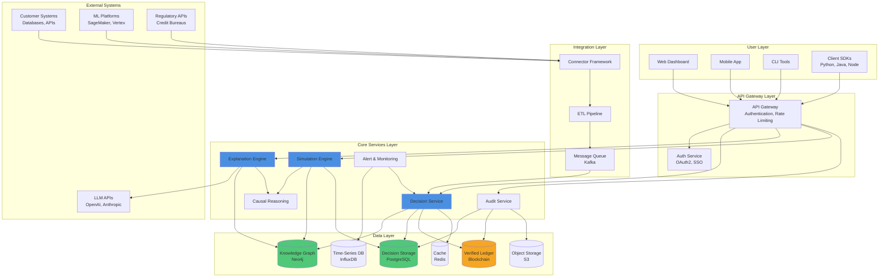

**Key Components:**

- **User Layer:** Multiple interfaces for different personas (developers, compliance teams, auditors)
- **API Gateway:** Central entry point with security and rate limiting
- **Core Services:** Business logic microservices
- **Integration Layer:** Connects to customer systems
- **Data Layer:** Multi-model data storage (graph, relational, blockchain, cache)
- **External Systems:** Third-party integrations

---

<a name="data-flow"></a>

## 2. Data Flow Diagram — Decision Logging

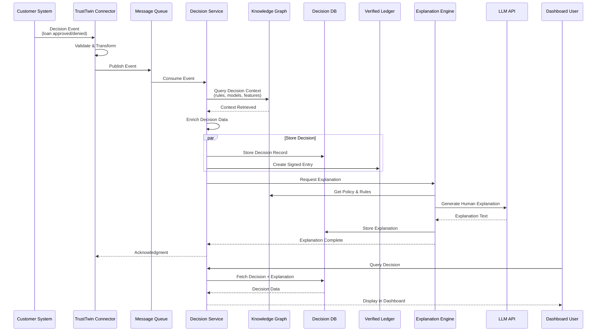

**Flow Steps:**

1. Customer system makes a decision (e.g., loan approval)
2. TrustTwin connector captures and validates the event
3. Event queued for processing (ensures no data loss)
4. Decision service enriches data from knowledge graph
5. Parallel storage: relational DB + tamper-proof ledger
6. Explanation engine generates human-readable text
7. User can view complete decision with explanation

---

<a name="component-architecture"></a>

## 3. Component Architecture — Detailed View

```mermaid
graph TB
    subgraph "Presentation Layer"
        WebUI[Web Dashboard<br/>React + TypeScript]
        MobileApp[Mobile App<br/>React Native]
        APIDoc[API Documentation<br/>OpenAPI/Swagger]
    end

    subgraph "API Layer"
        RestAPI[REST API<br/>FastAPI/Python]
        GraphQLAPI[GraphQL API<br/>Optional]
        WebSocket[WebSocket<br/>Real-time Updates]
    end

    subgraph "Business Logic Layer"
        subgraph "Decision Management"
            DecisionSvc[Decision Service]
            PolicyMgr[Policy Manager]
            VersionCtrl[Version Control]
        end

        subgraph "Intelligence Layer"
            ExplainSvc[Explanation Service]
            CausalEngine[Causal Engine]
            SimEngine[Simulation Engine]
            MLWrapper[ML Model Wrapper]
        end

        subgraph "Compliance & Audit"
            AuditSvc[Audit Service]
            ComplianceChk[Compliance Checker]
            ReportGen[Report Generator]
        end

        subgraph "Governance"
            AccessCtrl[Access Control<br/>RBAC]
            AuditLog[Audit Logger]
            Alerting[Alert Manager]
        end
    end

    subgraph "Data Access Layer"
        KGDAL[Knowledge Graph DAL]
        DecisionDAL[Decision DAL]
        LedgerDAL[Ledger DAL]
        CacheDAL[Cache DAL]
    end

    subgraph "Infrastructure Layer"
        subgraph "Data Stores"
            Neo4j[(Neo4j<br/>Knowledge Graph)]
            Postgres[(PostgreSQL<br/>Decisions)]
            LedgerDB[(Ledger<br/>Blockchain)]
            Redis[(Redis Cache)]
            S3[(S3 Storage)]
        end

        subgraph "Message & Events"
            Kafka[Kafka<br/>Event Stream]
            RabbitMQ[RabbitMQ<br/>Task Queue]
        end

        subgraph "External Services"
            OpenAI[OpenAI API]
            Anthropic[Anthropic API]
            CloudServices[AWS/Azure/GCP]
        end
    end

    WebUI --> RestAPI
    MobileApp --> RestAPI
    RestAPI --> DecisionSvc
    RestAPI --> ExplainSvc
    RestAPI --> SimEngine
    RestAPI --> AuditSvc

    DecisionSvc --> PolicyMgr
    DecisionSvc --> VersionCtrl
    DecisionSvc --> KGDAL
    DecisionSvc --> DecisionDAL
    DecisionSvc --> LedgerDAL

    ExplainSvc --> CausalEngine
    ExplainSvc --> MLWrapper
    ExplainSvc --> OpenAI
    ExplainSvc --> Anthropic

    SimEngine --> CausalEngine
    SimEngine --> KGDAL

    AuditSvc --> ComplianceChk
    AuditSvc --> ReportGen

    AccessCtrl --> AuditLog
    Alerting --> Kafka

    KGDAL --> Neo4j
    DecisionDAL --> Postgres
    LedgerDAL --> LedgerDB
    CacheDAL --> Redis

    DecisionSvc --> Kafka

    style DecisionSvc fill:#4A90E2
    style ExplainSvc fill:#4A90E2
    style SimEngine fill:#4A90E2
    style CausalEngine fill:#9013FE
    style Neo4j fill:#50C878
    style Postgres fill:#50C878
    style LedgerDB fill:#F5A623
```

---

<a name="decision-pipeline"></a>

## 4. Decision Processing Pipeline

```mermaid
flowchart LR
    subgraph "Ingestion Stage"
        A[Decision Event] --> B{Validate Schema}
        B -->|Valid| C[Enrich Metadata]
        B -->|Invalid| Z1[Error Queue]
        C --> D[Deduplicate]
        D --> E[Transform Format]
    end

    subgraph "Context Gathering Stage"
        E --> F[Query Knowledge Graph]
        F --> G[Retrieve Business Rules]
        F --> H[Fetch Model Metadata]
        F --> I[Get Historical Context]
        G --> J[Merge Context]
        H --> J
        I --> J
    end

    subgraph "Analysis Stage"
        J --> K[Feature Extraction]
        K --> L[Rule Evaluation]
        L --> M[Model Inference<br/>if needed]
        M --> N[Decision Validation]
        N -->|Valid| O[Continue]
        N -->|Invalid| Z2[Flag for Review]
    end

    subgraph "Storage Stage"
        O --> P[Generate Decision ID]
        P --> Q[Cryptographic Signing]
        Q --> R{Parallel Storage}
        R --> S[PostgreSQL<br/>Full Record]
        R --> T[Ledger<br/>Signed Hash]
        R --> U[Cache<br/>Recent Decisions]
        R --> V[S3<br/>Artifacts]
    end

    subgraph "Explanation Stage"
        S --> W[Generate Explanation]
        W --> X{Explanation Type}
        X -->|Customer| Y1[Simple Template]
        X -->|Auditor| Y2[Detailed Technical]
        X -->|Regulator| Y3[Compliance Report]
        Y1 --> AA[Store Explanation]
        Y2 --> AA
        Y3 --> AA
    end

    subgraph "Post-Processing Stage"
        AA --> AB[Update Metrics]
        AB --> AC[Check Alert Rules]
        AC -->|Triggered| AD[Send Alert]
        AC -->|OK| AE[Complete]
        AD --> AE
    end

    style A fill:#E8F5E9
    style Q fill:#F5A623
    style W fill:#4A90E2
    style AE fill:#66BB6A
    style Z1 fill:#EF5350
    style Z2 fill:#EF5350
```

**Pipeline Stages:**

1. **Ingestion:** Validate, enrich, deduplicate incoming decisions
2. **Context Gathering:** Pull relevant rules, models, historical data from knowledge graph
3. **Analysis:** Extract features, evaluate rules, validate decision logic
4. **Storage:** Store in multiple systems (DB, ledger, cache, storage) in parallel
5. **Explanation:** Generate appropriate explanation for different audiences
6. **Post-Processing:** Update metrics, trigger alerts if needed

**Performance Targets:**

- Ingestion to storage: <100ms (P99)
- Full pipeline completion: <2s (P95)
- Throughput: 10,000+ decisions/second per cluster

---

<a name="knowledge-graph"></a>

## 5. Knowledge Graph Structure

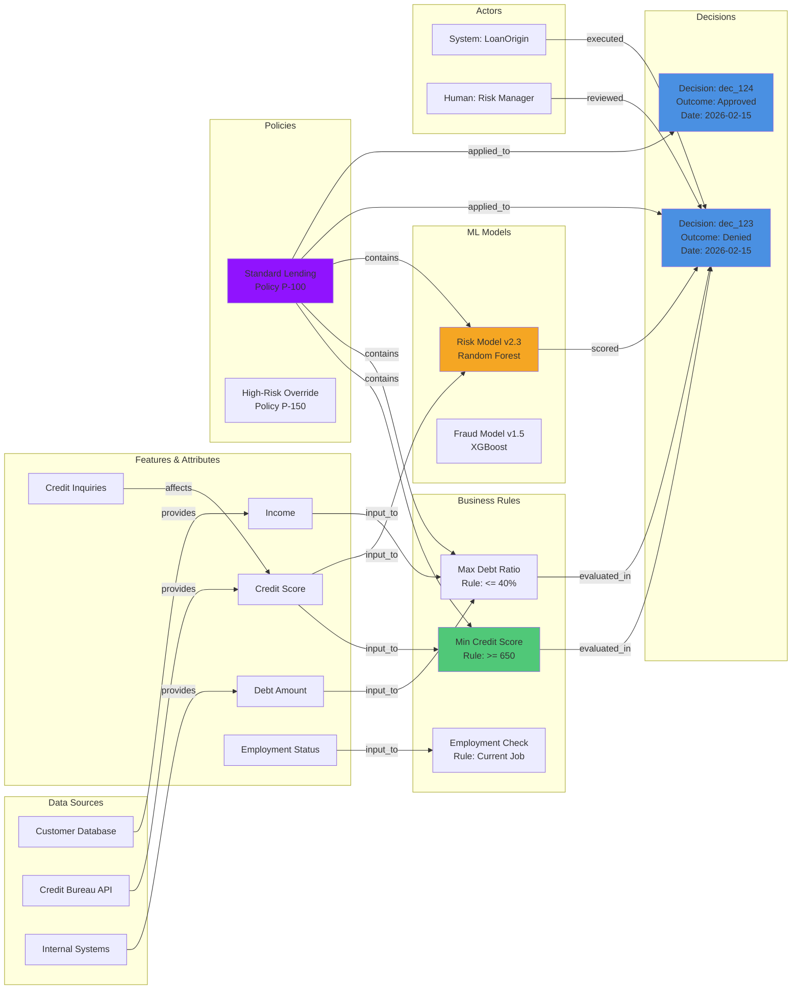

**Graph Node Types:**

- **Data Sources:** Where features come from
- **Features:** Individual data points used in decisions
- **Rules:** Business logic (thresholds, conditions)
- **Models:** ML models with version info
- **Policies:** Collections of rules and models
- **Decisions:** Individual decision records
- **Actors:** Systems or humans involved

**Graph Relationships:**

- `provides`, `input_to`, `affects`, `evaluated_in`, `scored`, `contains`, `applied_to`, `executed`, `reviewed`

**Use Cases:**

- **Lineage tracking:** "Where did this feature value come from?"
- **Impact analysis:** "If I change this rule, what decisions are affected?"
- **Root cause:** "Why did this decision turn out this way?"
- **Simulation:** "What if I change this model version?"

---

<a name="explanation-engine"></a>

## 6. Explanation Engine Flow

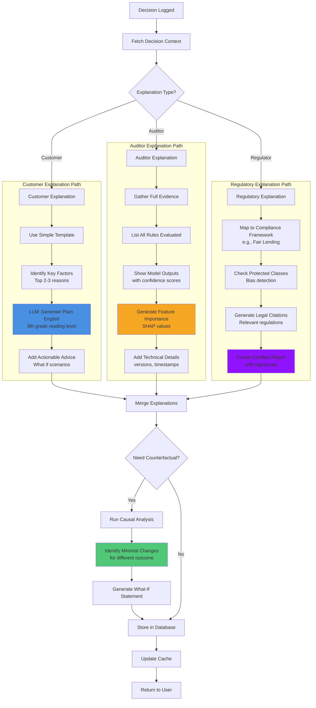

**Explanation Types & Examples:**

**Customer Explanation:**

```
Your loan application was denied because:
1. Your credit score (620) is below our minimum requirement (650)
2. Your debt-to-income ratio (48%) exceeds our maximum (40%)

To improve your chances:
• Pay down $5,000 in debt → approval likely
• Wait 3 months for credit score to recover → approval possible
```

**Auditor Explanation:**

```
Decision ID: dec_abc123
Timestamp: 2026-02-15 10:23:45 UTC
Policy: Standard Lending v2.0

Rules Evaluated:
✗ min_credit_score: 620 < 650 (FAILED)
✗ max_debt_ratio: 48% > 40% (FAILED)
✓ employment_status: employed (PASSED)

Models:
• risk_model_v2.3: score=0.72 (threshold=0.50)
• fraud_model_v1.5: score=0.15 (low risk)

SHAP Feature Importance:
1. credit_score: -0.45 (negative impact)
2. debt_ratio: -0.32 (negative impact)
3. employment: +0.18 (positive impact)
```

**Regulatory Explanation:**

```
FAIR LENDING COMPLIANCE REPORT
Decision: dec_abc123

Protected Class Analysis:
✓ No disparate treatment detected
✓ Adverse action compliant (15 USC § 1691)
✓ Credit reporting notification sent

Basis for Decision:
• Creditworthiness criteria applied uniformly
• No consideration of prohibited factors
• Automated decision validated against policy P-100

Certification: Cryptographic signature attached
Verification: Passed (hash: sha256:abc...)
```

---

<a name="simulation-engine"></a>

## 7. Simulation Engine Architecture

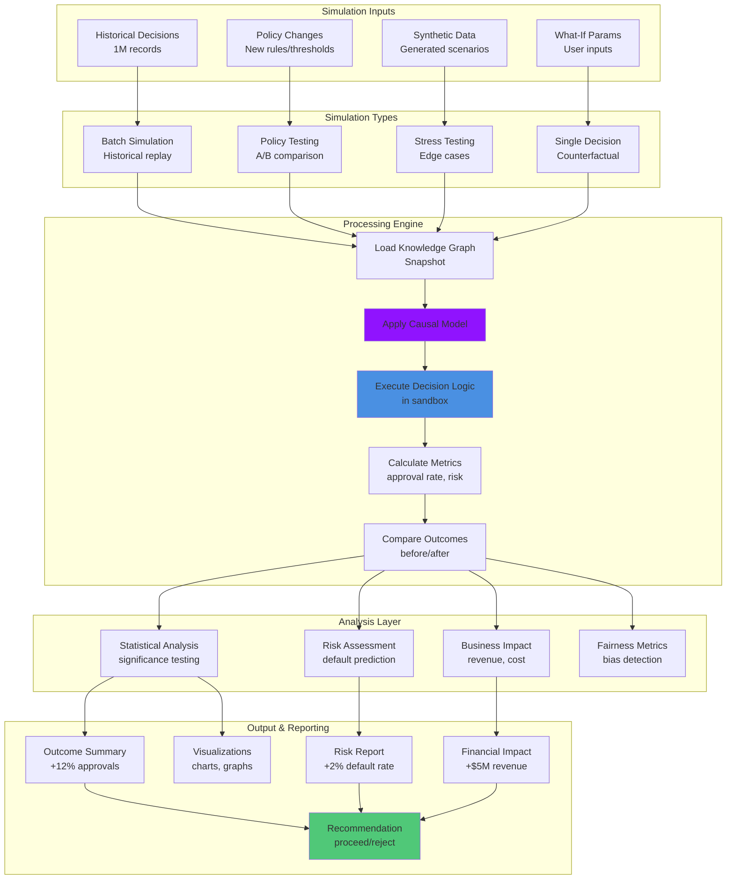

**Simulation Example:**

**Scenario:** "What if we lower minimum credit score from 650 → 640?"

**Process:**

1. Load last 100K loan decisions from database
2. Create knowledge graph snapshot with current policy
3. Apply change: min_credit_score = 640 (instead of 650)
4. Re-run decision logic on all 100K applications
5. Compare outcomes:

```
Before (650 threshold):
• Approvals: 72,000 (72%)
• Denials: 28,000 (28%)
• Expected defaults: 3,600 (5% of approvals)
• Revenue: $50M

After (640 threshold):
• Approvals: 84,000 (84%) ← +12,000 (+16.7%)
• Denials: 16,000 (16%)
• Expected defaults: 5,040 (6% of approvals) ← +1,440 (+40%)
• Revenue: $58M ← +$8M (+16%)

Net Impact:
✓ Revenue increase: +$8M
✗ Default cost increase: +$2M (1,440 × $1,400 avg)
✓ Net benefit: +$6M

Fairness Check:
✓ No disparate impact on protected classes
✓ Approval rate increase uniform across demographics

Recommendation: ✓ PROCEED with policy change
```

---

<a name="security-layers"></a>

## 8. Security & Privacy Layers

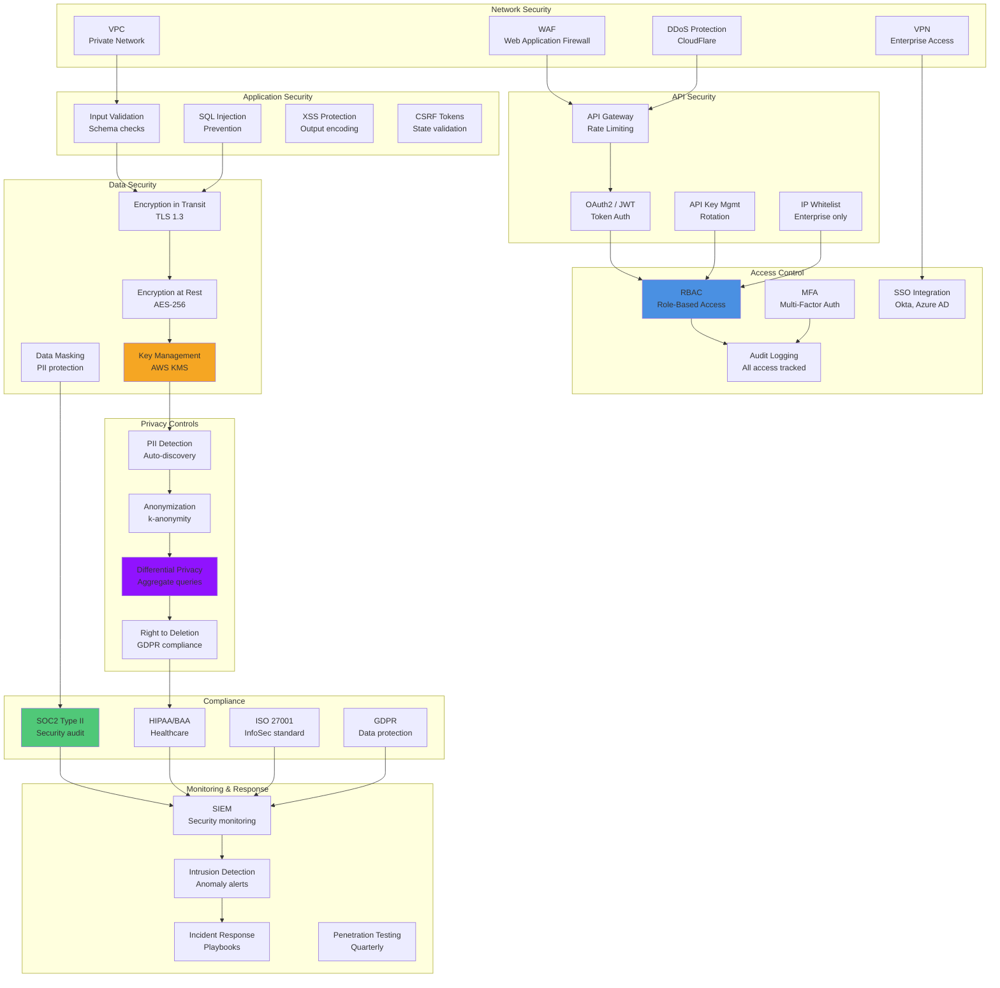

**Security Zones:**

```mermaid
graph LR
    subgraph "Internet Zone"
        User[Users<br/>Public Internet]
    end

    subgraph "DMZ - Demilitarized Zone"
        LB[Load Balancer]
        WAF[WAF]
        API[API Gateway]
    end

    subgraph "Application Zone - Private Subnet"
        App1[Decision Service]
        App2[Explanation Service]
        App3[Simulation Service]
    end

    subgraph "Data Zone - Highly Restricted"
        DB1[(Decision DB)]
        DB2[(Knowledge Graph)]
        DB3[(Ledger)]
    end

    subgraph "Management Zone"
        Admin[Admin Portal]
        Monitor[Monitoring]
        Backup[Backup Service]
    end

    User -->|HTTPS| LB
    LB --> WAF
    WAF --> API
    API -->|Internal TLS| App1
    API -->|Internal TLS| App2
    API -->|Internal TLS| App3

    App1 -->|Encrypted| DB1
    App2 -->|Encrypted| DB2
    App3 -->|Encrypted| DB1

    Admin -->|VPN Only| Monitor
    Monitor --> App1
    Backup -->|Encrypted| DB1

    style DMZ fill:#FFE0B2
    style "Application Zone - Private Subnet" fill:#E1F5FE
    style "Data Zone - Highly Restricted" fill:#F3E5F5
```

**Data Privacy Flow:**

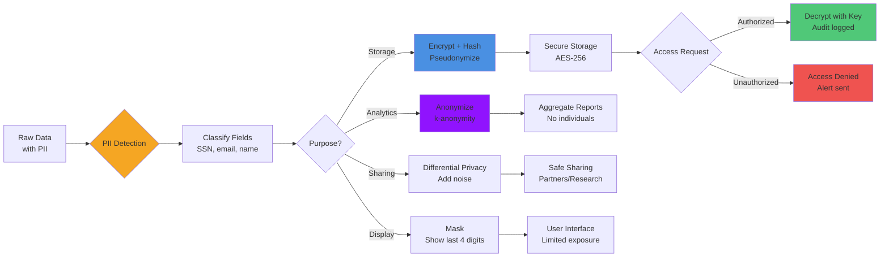

---

<a name="deployment-architecture"></a>

## 9. Deployment Architecture

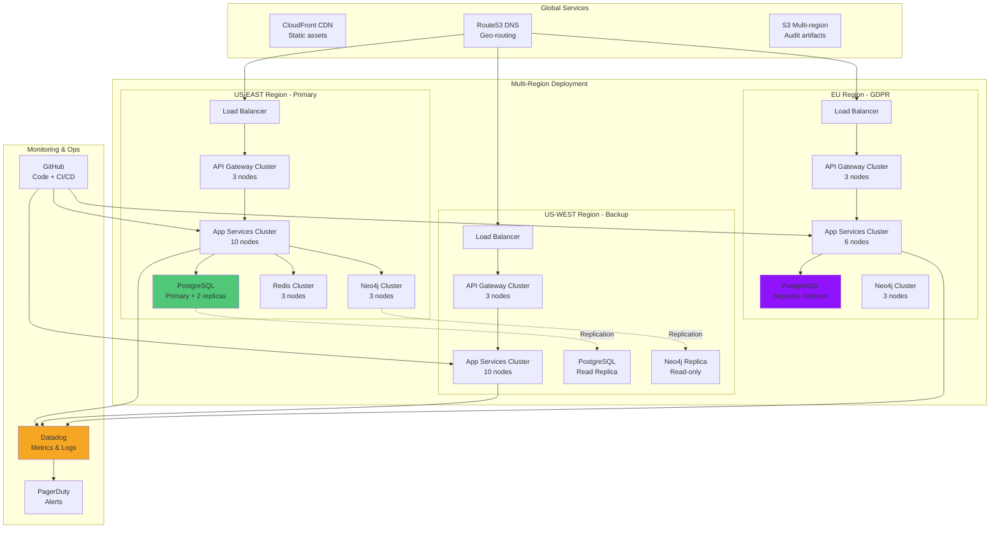

**Kubernetes Architecture:**

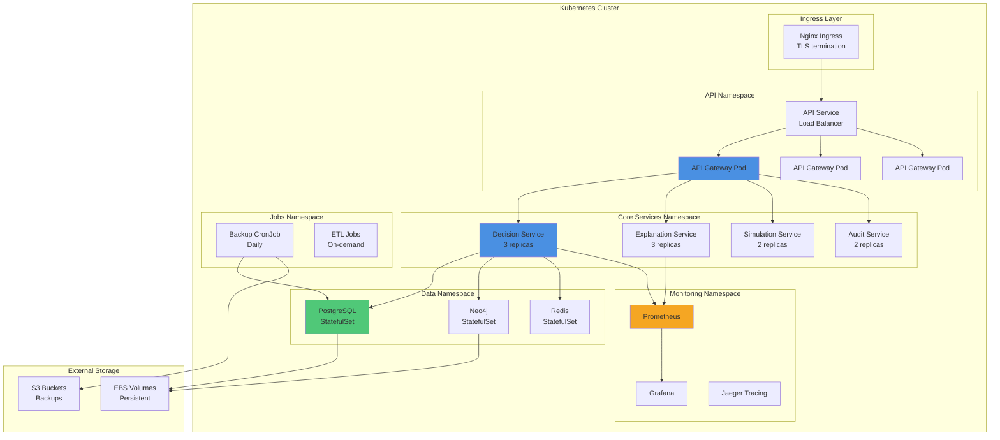

**Scaling Strategy:**

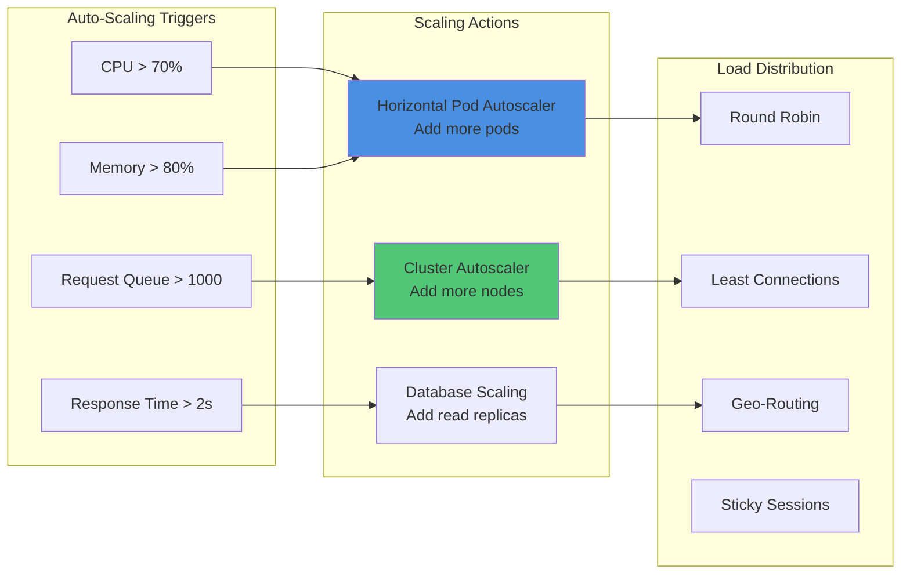

---

<a name="integration-patterns"></a>

## 10. Integration Patterns

**Pattern 1: Real-Time Decision Logging**

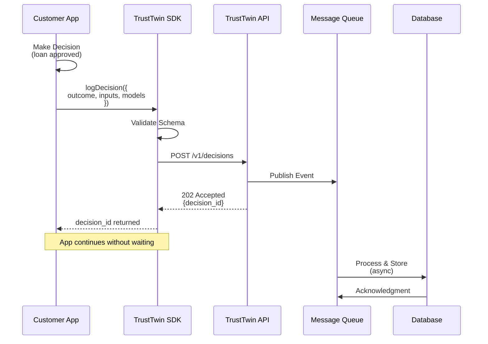

**Pattern 2: Batch Upload**

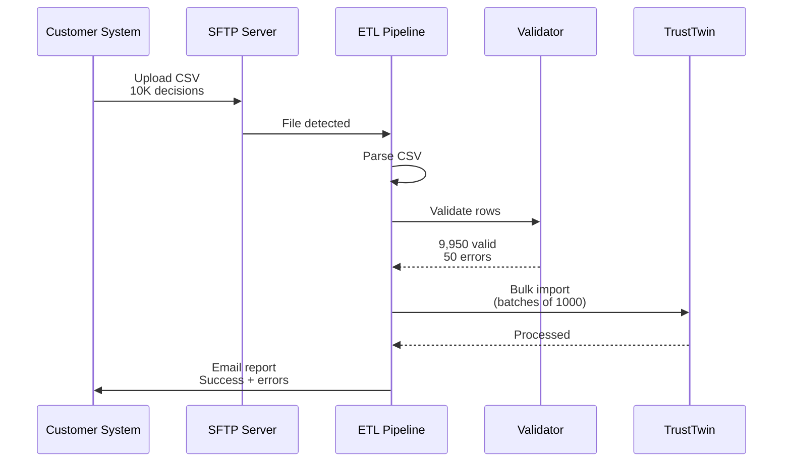

**Pattern 3: Webhook Events**

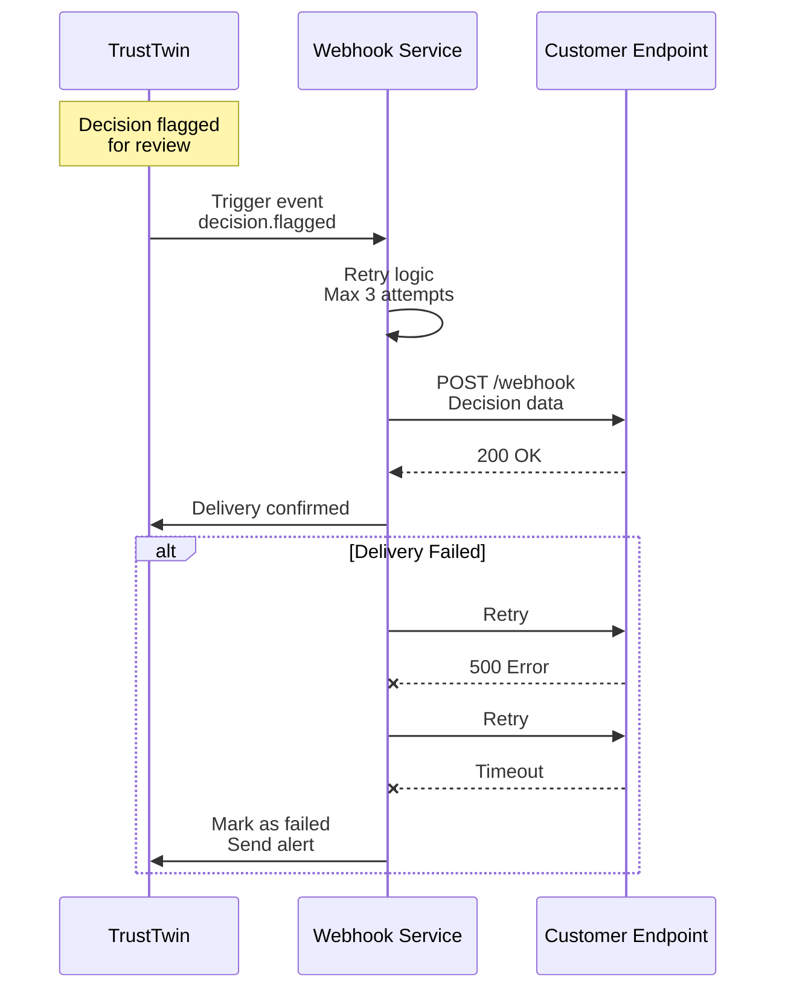

**Pattern 4: Streaming Integration (Kafka)**

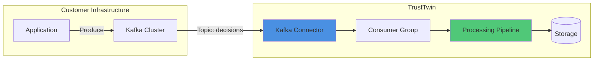

---

<a name="microservices"></a>

## 11. Microservices Architecture

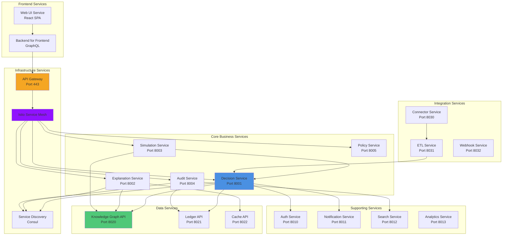

**Service Communication:**

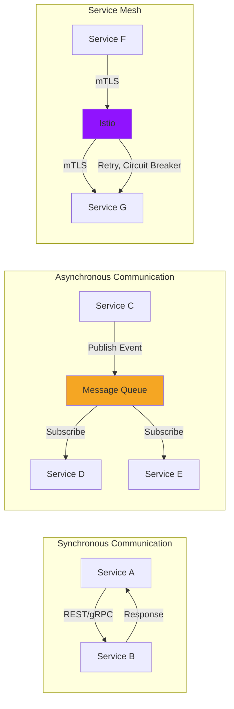

---

<a name="database-schema"></a>

## 12. Database Schema Overview

**PostgreSQL — Decisions Table**

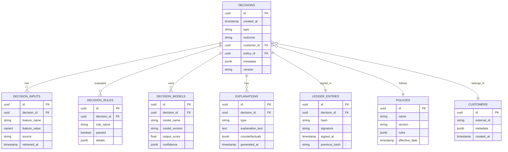

**Neo4j — Knowledge Graph Schema**

```mermaid
graph LR
    subgraph "Node Types"
        N1[DataSource]
        N2[Feature]
        N3[Rule]
        N4[Model]
        N5[Policy]
        N6[Decision]
        N7[Actor]
    end

    subgraph "Relationships"
        N1 -->|PROVIDES| N2
        N2 -->|INPUT_TO| N3
        N2 -->|INPUT_TO| N4
        N3 -->|PART_OF| N5
        N4 -->|PART_OF| N5
        N5 -->|APPLIED_TO| N6
        N3 -->|EVALUATED_IN| N6
        N4 -->|SCORED| N6
        N7 -->|EXECUTED| N6
    end

    style N1 fill:#E3F2FD
    style N2 fill:#FFF3E0
    style N3 fill:#E8F5E9
    style N4 fill:#F3E5F5
    style N5 fill:#FCE4EC
    style N6 fill:#4A90E2
    style N7 fill:#FFE0B2
```

---

## Summary

These diagrams provide a comprehensive visual overview of TrustTwin's technical architecture:

1. **System Architecture:** High-level view of all components and their interactions
2. **Data Flow:** How decisions flow through the system from capture to storage
3. **Component Architecture:** Detailed service breakdown and responsibilities
4. **Decision Pipeline:** Step-by-step processing of decisions
5. **Knowledge Graph:** Structure and relationships for decision context
6. **Explanation Engine:** Multi-path explanation generation
7. **Simulation Engine:** What-if analysis and policy testing
8. **Security Layers:** Multi-layer defense and privacy controls
9. **Deployment:** Multi-region, Kubernetes-based infrastructure
10. **Integration Patterns:** How customers connect to TrustTwin
11. **Microservices:** Service decomposition and communication
12. **Database Schema:** Data model for relational and graph databases

**For Engineering Teams:**

- Use these diagrams as reference during implementation
- Each diagram maps to specific sprint deliverables
- Architecture supports horizontal scaling and high availability

**For Investors:**

- Demonstrates technical sophistication and feasibility
- Shows scalability and enterprise-readiness
- Highlights security and compliance built-in from day one

---

**Next Steps:**

- Export diagrams to PNG/SVG for presentations
- Update as architecture evolves
- Use as onboarding materials for new engineers

**Tools for Rendering:**

- Mermaid Live Editor: https://mermaid.live
- VS Code Mermaid Extension
- GitHub/GitLab (native Mermaid support)
- Markdown viewers (most support Mermaid)

---

_Document Version 1.0 | February 15, 2026_
